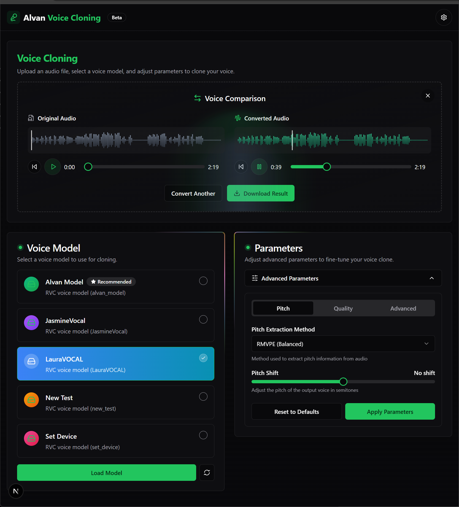

# 🎙️ Alvan Voice Cloning


<div align="center">
  
  <p><em>A modern, sleek interface for RVC voice cloning technology</em></p>
</div>

## 🌟 Features

- **User-Friendly Interface**: Modern, intuitive design with dark mode support
- **Drag-and-Drop Audio Upload**: Simple audio file uploading with waveform visualization
- **Real-Time Voice Conversion**: Process audio using the selected RVC model
- **Model Selection**: Switch between different trained voice models
- **Advanced Parameters**: Fine-tune conversion settings for optimal results
- **Audio Comparison**: Compare original and converted audio side by side
- **Responsive Design**: Works seamlessly across desktop and tablet devices

## 🛠️ Tech Stack

- **Frontend**: Next.js 15, React 19, TypeScript
- **Styling**: Tailwind CSS, Framer Motion for animations
- **UI Components**: Radix UI primitives with custom components
- **Audio Processing**: Integrates with RVC Python API for voice conversion
- **State Management**: React hooks for local state management
- **Form Handling**: React Hook Form with Zod validation

## 🚀 Getting Started

### Prerequisites

Before you can use the Alvan Voice Cloning web interface, you need to set up the RVC Python API server:

1. **Clone and Install the RVC Python Backend**:
   ```bash
   git clone https://github.com/daswer123/rvc-python
   cd rvc-python
   ```

2. **Follow the Setup Instructions**:
   Follow the installation instructions in the [RVC Python repository](https://github.com/daswer123/rvc-python) to install dependencies and set up the environment.

3. **Start the RVC API Server**:
   ```bash
   python server.py
   ```
   The API server will run at `http://localhost:5050` by default.

### Setting Up the Frontend

1. **Clone the Repository**:
   ```bash
   git clone (https://github.com/WebChatAppAi/Alvan-Voice-CLONING)
   cd alvan-voice-cloning
   ```

2. **Install Dependencies**:
   ```bash
   npm install
   # or
   pnpm install
   ```

3. **Run the Development Server**:
   ```bash
   npm run dev
   # or
   pnpm dev
   ```

4. **Open the App**:
   Navigate to `http://localhost:3000` in your browser.

5. **Connect to the RVC API**:
   - Click the Settings icon (⚙️) in the top-right corner
   - Enter the RVC API URL (default: `http://localhost:5050`)
   - Click "Test Connection" to verify connectivity
   - Save your settings

## 📘 How to Use

### 1. Configure API Connection

- On first launch, click the Settings icon in the top right corner
- Enter your RVC Python API URL (default is `http://localhost:5050`)
- Select your computation device (CPU or GPU)
- Test the connection and save settings

### 2. Select a Voice Model

- The application will automatically load available models from your RVC Python server
- Select a model from the list to load it for voice conversion

### 3. Upload Audio for Conversion

- Drag and drop an audio file or click to browse
- Supported formats: WAV, MP3, FLAC, etc.
- The uploaded audio will be visualized as a waveform

### 4. Adjust Parameters (Optional)

- Expand the "Advanced Parameters" section to fine-tune conversion settings
- Modify F0 method, pitch adjustment, filter settings, etc.
- Apply changes before processing

### 5. Process Audio

- Click "Start Processing" to begin voice conversion
- Monitor the progress bar as the audio is processed
- When complete, both original and converted audio will be available for comparison

### 6. Compare and Save

- Listen to both the original and converted audio clips
- Download the converted audio for use in your projects

## 🧩 Integration Details

This frontend is designed to work with the [RVC Python API](https://github.com/daswer123/rvc-python) which provides the actual voice conversion functionality. The integration works through a RESTful API with the following endpoints:

| Endpoint               | Method | Description                               |
|------------------------|--------|-------------------------------------------|
| `/models`              | GET    | Get a list of available voice models      |
| `/models/:modelName`   | POST   | Load a specific model                     |
| `/params`              | GET    | Get current conversion parameters         |
| `/params`              | POST   | Set conversion parameters                 |
| `/convert`             | POST   | Convert audio using the loaded model      |
| `/set_device`          | POST   | Set the computation device (CPU/GPU)      |
| `/upload_model`        | POST   | Upload a new model file                   |

## 🛡️ Requirements

- **Backend**: RVC Python API running (supports CUDA for GPU acceleration)
- **Browser**: Modern browser with WebAudio API support
- **System**: For running the backend with GPU support:
  - NVIDIA GPU with CUDA support (recommended for faster processing)
  - Minimum 8GB RAM (16GB+ recommended)

## 📝 License

This project is licensed under the MIT License - see the LICENSE file for details.

## 🙏 Acknowledgments

- [Retrieval-based Voice Conversion WebUI](https://github.com/RVC-Project/Retrieval-based-Voice-Conversion-WebUI) for the original RVC technology
- [RVC Python](https://github.com/daswer123/rvc-python) for the backend API implementation
- [Radix UI](https://www.radix-ui.com/) for accessible UI components
- [Tailwind CSS](https://tailwindcss.com/) for styling utilities
- [Framer Motion](https://www.framer.com/motion/) for animations

---

<div align="center">
  <p>Created with ❤️ by Alvan</p>
  <p>If you find this project helpful, please consider giving it a star! ⭐</p>
</div>
